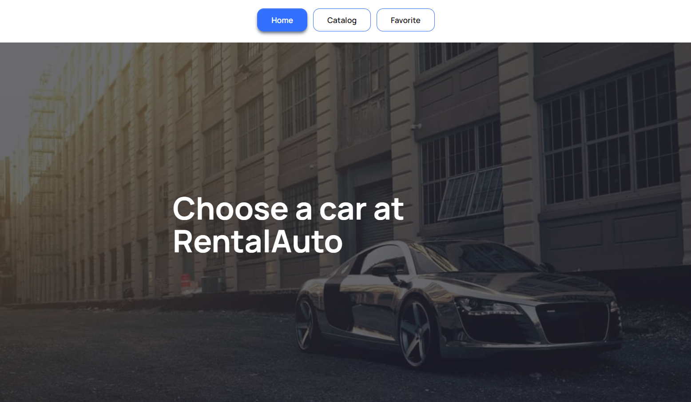

This project was created with
[Create React App](https://github.com/facebook/create-react-app).

## Web application RentalAuto

RentalAuto is a web service that will help you choose a car for rent.

## Technologies used:

- HTML5/CSS3
- JavaScript
- React
- Redux Toolkit/Persist
- Axios
- Formik
- Figma
- MockAPI

## Getting Started

To start working on the application, clone the repository and install all the dependencies:

-npm clone https://github.com/dmytro-liashok/RentalAuto.git

-npm install or npm i

## About project:

With this app, people will be able to choose a comfortable car to use by filtering ads by brand, price per hour of use, and mileage. If you want to use the car again or at a later date, you can save the ad to your favorites list.
The application contains three pages

- Home
- Catalog
- Favorite

# Home

Home page is the main page that the user gets to when entering the application

# Catalog

Catalog page is a central hub within the application where users can explore a diverse range of cars available for rental. The page features an intuitive filter system that allows users to refine their search based on car brands, providing a streamlined browsing experience. Each car listing includes a "Learn More" button. Clicking on this button opens a detailed description of the advertisement, allowing users to access in-depth information about the selected car. This detailed view provides specifications, features, and any additional information relevant to the rental.You can also add any ad to your favorites that will be displayed on the Favorites page.

# Favorite

The Favorite page is your personalized space within the application, allowing you to curate a collection of advertisements that have captured your interest. This feature empowers users to save and revisit their favorite listings for quick and easy reference.

## Live page

The live page can be accessed through the following link:
https://dmytro-liashok.github.io/RentalAuto/

## Support

For more information, please contact us by e-mail: lyashokdima1@gmail.com
